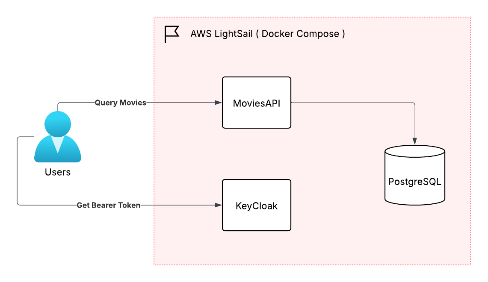
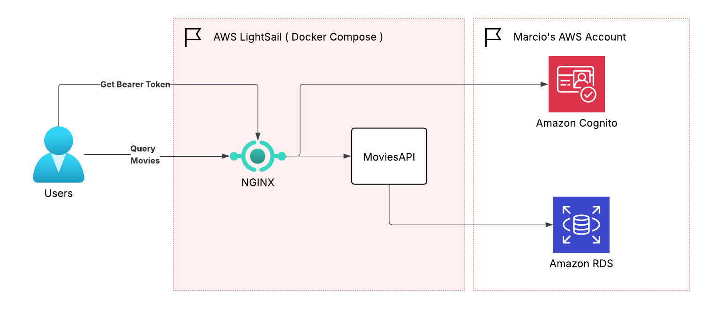
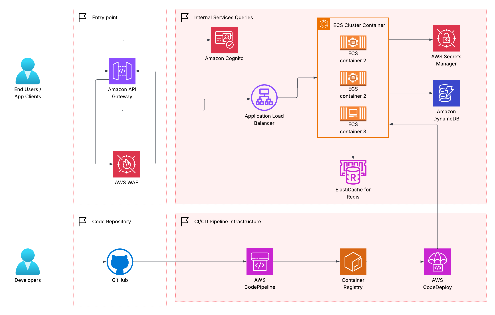

# 🎬 Movie API - Production-Ready REST Backend

A production-ready REST API for the MovieLens movies database, built with FastAPI and secured with OAuth2/Keycloak. Fully containerized with Docker Compose, comprehensive testing, and clean layered architecture.

## 📋 Quick Navigation

**🚀 Getting Started (Pick Your Path):**
- **[First-Time Setup](#quick-start)** - Local development in 5 minutes
- **[Docker Development](#docker-setup-for-development)** - Container-based workflow  
- **[Production Deployment](#deployment--production)** - Deploy to AWS LightSail

**📚 Key Documentation:**
- **[API Reference](#api-documentation)** - All endpoints, parameters, examples
- **[Authentication Setup](#authentication--security)** - Keycloak/Cognito configuration
- **[Database Optimization](#database-optimization-summary)** - Performance improvements explained
- **[Testing Guide](#testing)** - Run unit, integration, and validation tests
- **[Troubleshooting](#troubleshooting)** - Common issues and solutions

**📖 Further Reading (Detailed Guides):**
- **[OPTIMIZATION_SUMMARY.md](./OPTIMIZATION_SUMMARY.md)** - Technical deep dive on query optimization
- **[LIGHTSAIL_DEPLOYMENT.md](./LIGHTSAIL_DEPLOYMENT.md)** - Production AWS LightSail deployment
- **[QUICK_REFERENCE.md](./QUICK_REFERENCE.md)** - Before/after performance metrics
- **[TEST_UPDATES_SUMMARY.md](./TEST_UPDATES_SUMMARY.md)** - Test refactoring details

## 📋 Full Table of Contents

1. [About This Project](#about-this-project)
2. [Problem Statement](#problem-statement)
3. [Thought Process & Architecture](#thought-process--architecture)
4. [Features](#features)
5. [Project Structure](#project-structure)
6. [Prerequisites](#prerequisites)
7. [Quick Start](#quick-start)
8. [Docker Setup for Development](#docker-setup-for-development)
9. [Development Workflows](#development-workflows)
10. [API Documentation](#api-documentation)
11. [Authentication & Security](#authentication--security)
12. [Database Optimization Summary](#database-optimization-summary)
13. [Testing](#testing)
14. [Deployment & Production](#deployment--production)
15. [Architecture Deep Dive](#architecture-deep-dive)
16. [Troubleshooting](#troubleshooting)
17. [Supporting Documentation](#supporting-documentation)

---

## About This Project

This project demonstrates a **production-grade API implementation** following modern software engineering best practices. It showcases:

- ✅ Clean layered architecture (controller → service → repository → domain)
- ✅ Professional code organization and separation of concerns
- ✅ OAuth2 security with Keycloak identity management
- ✅ Comprehensive test coverage (167 tests: 134 unit + 33 integration)
- ✅ Docker Compose orchestration with profile-based selective deployment
- ✅ Development workflow automation with Makefile
- ✅ Multi-environment support (dev, test, production-like)

---

## Problem Statement

### The Assignment

Build a simple API that serves movie data, deployed within a Docker container, demonstrating:

**Core Requirements:**
- REST API endpoint that returns a list of movies
- Application packaged and running in Docker container
- Clean, well-structured code following modern development practices

**Optional Enhancements:**
- List API with filters, pagination, and search capabilities
- Search endpoint for movies
- Authentication layer to secure the API

**Dataset:** MovieLens public dataset (https://grouplens.org/datasets/movielens/)

---

## Thought Process & Architecture

### 1. Understanding the Requirements

Upon analyzing the assignment, I recognized this would be a **read-heavy service** designed to serve movie data efficiently. This informed all subsequent architectural decisions around:
- In-memory caching for fast reads
- Pagination to prevent large payloads
- Efficient filtering mechanisms

### 2. Layered Architecture Pattern

I adopted the classic **layered architecture pattern** to maintain clean separation of concerns:

```
HTTP Request
    ↓
[Controller/Route Layer] - Request validation, HTTP concerns
    ↓
[Service Layer] - Business logic, filtering, search algorithms
    ↓
[Repository Layer] - Data access abstraction, query logic
    ↓
[Domain Layer] - Data models, business entities
    ↓
[Data Storage] - CSV file, database, external APIs
```

This pattern ensures:
- **Testability**: Each layer can be tested independently
- **Maintainability**: Changes to data sources don't affect business logic
- **Scalability**: Easy to swap repositories (CSV → Database → API)
- **Reusability**: Services can be used by multiple controllers

### 3. Framework Selection: FastAPI

After researching options, I selected **FastAPI** over Flask because:
- **Performance**: FastAPI claims performance on par with Go and Node.js
- **Modern Python**: Built on async/await for concurrent request handling
- **Type Safety**: Leverages Python type hints for validation and documentation
- **Auto-Documentation**: Automatic Swagger UI and ReDoc generation
- **Developer Experience**: Intuitive routing, built-in dependency injection
- **Pydantic Integration**: First-class support for data validation models

**Reference**: https://fastapi.tiangolo.com/tutorial/bigger-applications/

### 4. Security: OAuth2 with JWT Bearer Tokens

This API implements **OAuth2 Bearer Token authentication** using JWT (JSON Web Tokens) for secure access. The authentication provider varies by environment:

**Environment-Specific Providers:**
- **Local Development**: Keycloak (open-source identity and access management)
  - Runs in Docker container via `docker-compose.yml`
  - Provides centralized identity management with zero-trust architecture
  - Useful for testing OAuth2 workflows locally
  
- **Production (AWS LightSail)**: AWS Cognito (AWS managed identity service)
  - Fully managed authentication without operational overhead
  - Seamless integration with AWS infrastructure
  - Provides industry-grade security and compliance

**Security Features (Environment-Agnostic):**
- **Bearer token authentication**: Standard JWT-based token validation
- **Production-grade security**: OAuth2 compliance with industry standards
- **Token signature validation**: JWKS endpoint for key verification
- **Zero-trust architecture**: Every request requires valid JWT signature
- **Extensibility**: Support for multiple identity providers and future microservices
- **RS256 cryptography**: RSA Signature with SHA-256 (asymmetric, industry standard)

### 5. Test Pyramid

The test suite follows the **test pyramid** principle:

```
                ▰▰▰▰▰▰▰▰
               ▰ End to End ▰
              ▰▰▰▰▰▰▰▰▰▰▰▰▰
             ▰    (33 tests)  ▰
            ▰▰▰▰▰▰▰▰▰▰▰▰▰▰▰▰▰
           ▰  Integration (60)  ▰
          ▰▰▰▰▰▰▰▰▰▰▰▰▰▰▰▰▰▰▰▰▰
         ▰    Unit Tests (74)    ▰
        ▰▰▰▰▰▰▰▰▰▰▰▰▰▰▰▰▰▰▰▰▰▰▰▰
```

This ensures quick feedback (unit tests) while validating real workflows (integration tests).

---

## Features

- **REST API** with paginated movie listings
- **Advanced Filtering** by title, genre, year, and combinations
- **Full-Text Search** endpoint for flexible movie discovery
- **Single Movie Lookup** by ID
- **OAuth2 Bearer Token Authentication** via Keycloak
- **JWT Signature Verification** with JWKS validation
- **Health Check** endpoint
- **Auto-generated API Documentation** (Swagger UI, ReDoc)
- **Docker Compose Orchestration** with profile-based selective startup
- **Comprehensive Test Suite** with 167 passing tests
- **Development Automation** with Makefile for all workflows
- **Multi-Environment Support**: dev-only, testing, and production-like

## Project Structure

```
movie_api/
├── app/
│   ├── __init__.py
│   ├── main.py                      # FastAPI app factory and startup/shutdown
│   ├── api/
│   │   ├── __init__.py
│   │   ├── routes_health.py         # Health check routes (public)
│   │   └── routes_movies.py         # Movie API routes (OAuth2 protected)
│   ├── core/
│   │   ├── __init__.py
│   │   ├── config.py                # Configuration & environment variables
│   │   ├── keycloak.py              # OAuth2 & JWT validation logic
│   │   └── logging_config.py        # Structured logging setup
│   ├── models/
│   │   ├── __init__.py
│   │   └── movie.py                 # Pydantic domain models
│   ├── repositories/
│   │   ├── __init__.py
│   │   └── movies_repository.py     # Data access layer (CSV abstraction)
│   ├── services/
│   │   ├── __init__.py
│   │   └── movies_service.py        # Business logic layer
│   └── deps/
│       ├── __init__.py
│       └── auth.py                  # OAuth2 dependency injection
├── data/
│   └── movies.csv                   # MovieLens dataset (downloaded at setup)
├── migrations/
│   └── versions/                    # Alembic database migrations
├── tests/
│   ├── __init__.py
│   ├── conftest.py                  # Pytest fixtures & configuration
│   ├── unit/
│   │   ├── models/
│   │   │   └── test_movie_models.py
│   │   ├── repositories/
│   │   │   └── test_movies_repository.py
│   │   ├── services/
│   │   │   └── test_movies_service.py
│   │   └── utils/
│   │       └── test_helpers.py
│   └── integration/
│       ├── test_api_endpoints.py
│       ├── test_auth_security.py
│       └── test_oauth2_flows.py
├── scripts/
│   ├── keycloak-setup.py            # Automated Keycloak realm/client setup
│   ├── db-setup.py                  # Database initialization
│   └── download_data.py             # MovieLens dataset downloader
├── Dockerfile                        # Multi-stage build for production
├── docker-compose.yml               # Orchestration with db, keycloak, app
├── Makefile                         # Development workflow automation
├── conftest.py                      # Global pytest configuration
├── migrate.sh                       # Database migration script
├── requirements.txt                 # Python dependencies (80+ packages)
├── .env.keycloak                    # Auto-generated Keycloak secrets (gitignored)
├── .gitignore                       # Excludes venv, .env, sensitive data
└── README.md                        # This file
```

### Key Directories Explained

| Directory | Purpose |
|-----------|---------|
| `app/api/` | FastAPI route handlers |
| `app/core/` | Configuration, security, logging |
| `app/models/` | Pydantic validation models |
| `app/repositories/` | Data access abstraction (interchangeable) |
| `app/services/` | Business logic (filters, search, validation) |
| `app/deps/` | Dependency injection for OAuth2, auth checks |
| `tests/unit/` | Unit tests (models, services, repos) |
| `tests/integration/` | End-to-end API and OAuth2 tests |
| `scripts/` | Setup automation scripts |

## Prerequisites

- **Python 3.11+** - For running the FastAPI application
- **Docker & Docker Compose** - For containerized deployment
- **curl** or **Postman** - For testing API endpoints
- **Git** - For cloning the repository
- **MovieLens Dataset** - Automatically downloaded during setup (or manually from https://grouplens.org/datasets/movielens/)

### System Requirements

- **Minimum**: 2GB RAM, 500MB disk space
- **Recommended**: 4GB RAM, 1GB disk space
- **Ports Required**: 
  - 8000 (API)
  - 5432 (PostgreSQL)
  - 8080 (Keycloak)

---

## Quick Start

### Option 1: Fastest Setup (Recommended)

```bash
# Clone the repository
cd movie_api

# Full setup with one command (installs venv, dependencies, Docker services, OAuth2)
make setup

# API is now running at http://localhost:8000
```

**What `make setup` does:**
1. ✅ Creates Python virtual environment
2. ✅ Installs all 80+ dependencies
3. ✅ Starts Docker services (PostgreSQL, Keycloak, App)
4. ✅ Runs database migrations
5. ✅ Initializes Keycloak realm and OAuth2 client
6. ✅ Creates test user credentials
7. ✅ Generates `.env.keycloak` with secrets

### Option 2: Development-Only Setup (No App Container)

```bash
# Start only infrastructure (database + Keycloak, no API container)
make dev-setup

# Run the app locally in development mode
make run-dev
```

**Use this when:**
- Actively developing Python code
- Need faster reload cycles
- Debugging locally with IDE

### Option 3: Testing Setup

```bash
# Start full stack for testing
make test-setup

# Run the complete test suite
make test
```

**Use this when:**
- Running integration tests
- Testing end-to-end workflows
- Validating deployment configuration

---

## Docker Setup for Development

### What Runs in Docker

The Docker Compose configuration provides:

| Service | Container | Purpose |
|---------|-----------|---------|
| **PostgreSQL** | `movie-db` | Movies database with optimized indexes |
| **Keycloak** | `movie-keycloak` | OAuth2/OpenID Connect identity provider |
| **FastAPI App** | `movie-api-app` | Movie API application (in full setup) |

### Docker Compose Profiles

The project uses Docker Compose profiles for flexible service selection:

```bash
# ✅ Development: Infrastructure only (database + Keycloak)
docker-compose --profile dev up -d

# ✅ Testing: Full stack including containerized app
docker-compose --profile test up -d

# ✅ Production-Like: All services with production configs
docker-compose --profile prod up -d

# ✅ All Services: Everything
docker-compose up -d
```

### Quick Docker Commands

```bash
# View running containers
docker-compose ps

# View logs for a service
docker-compose logs -f app              # App logs
docker-compose logs -f keycloak         # Keycloak logs
docker-compose logs -f postgres         # Database logs

# Stop all services
docker-compose down

# Stop and remove all data (volumes)
docker-compose down -v

# Rebuild images and restart
docker-compose up -d --build
```

### Rebuild and Deployment

For production deployments or CI/CD pipelines, force fresh Docker builds:

```bash
# Fresh build (no cached layers)
docker build -t movie-api:latest --no-cache .

# Clean up unused Docker resources
docker system prune -a
```

---

## Development Workflows

The project supports **three distinct development workflows** using Docker Compose profiles:

### 1. Infrastructure-Only (`make dev-setup`)

Perfect for **local development**:

```bash
make dev-setup    # Start PostgreSQL + Keycloak only
make run-dev      # Run FastAPI app locally with auto-reload
```

**Running services:**
- PostgreSQL: `localhost:5432`
- Keycloak: `http://localhost:8080`
- FastAPI: `http://localhost:8000` (local process)

**Advantages:**
- Fastest iteration (no container build)
- IDE debugger support
- Hot reload on file changes
- Direct logging to terminal

### 2. Testing Stack (`make test-setup`)

For **integration testing** and **validation**:

```bash
make test-setup   # Start all services including containerized app
pytest            # Run full test suite (167 tests)
```

**Running services:**
- PostgreSQL: `localhost:5432`
- Keycloak: `http://localhost:8080`
- FastAPI (Docker): `http://localhost:8000`
- App: Connected to real database

**Validates:**
- End-to-end API workflows
- OAuth2 token generation and validation
- Database migrations and queries

### 3. Full Setup (`make setup`)

For **production-like testing** and **complete validation**:

```bash
make setup        # Complete production setup
pytest            # Run all tests
```

Identical to test-setup but also validates:
- Container build process
- Docker networking
- Service orchestration
- Startup sequence

### Makefile Commands Reference

```bash
make help              # Show all available commands
make setup             # Full development environment (db + keycloak + app)
make dev-setup         # Infrastructure only (db + keycloak, no app)
make test-setup        # Full stack for testing (db + keycloak + migrations + app)
make run-dev           # Run app locally with auto-reload
make test              # Run all 167 tests (unit + integration)
make test-unit         # Run 134 unit tests only
make test-integration  # Run 33 integration tests only
make keycloak-setup    # Manually initialize Keycloak (auto-run during setup)
make db-setup          # Manually initialize database (auto-run during setup)
make down              # Stop all Docker containers
make clean             # Stop containers and remove volumes
make logs              # View container logs
```

### Virtual Environment Activation

After running `make setup` or `make dev-setup`:

```bash
# On macOS/Linux
source venv/bin/activate

# On Windows
venv\Scripts\activate
```

Then use Python normally:
```bash
pip install new-package
python scripts/download_data.py
pytest tests/unit -v
```

---

## API Documentation

### Access Interactive Documentation

Once the application is running, visit:

- **Swagger UI** (interactive): http://localhost:8000/docs
- **ReDoc** (read-only): http://localhost:8000/redoc
- **OpenAPI JSON**: http://localhost:8000/openapi.json

### Base URL

```
http://localhost:8000
```

All examples below assume the app is running locally.

### Health Check (No Authentication Required)

```http
GET /api/health
```

**Response (200 OK):**
```json
{
  "status": "ok",
  "timestamp": "2024-11-28T10:30:45.123456"
}
```

Use this endpoint to verify the API is running and database is accessible.

### List Movies (OAuth2 Required)

```http
GET /api/movies?page=1&page_size=20&title=toy&genre=Adventure&year=1995
Authorization: Bearer {access_token}
```

**Query Parameters:**
| Parameter | Type | Default | Description |
|-----------|------|---------|-------------|
| `page` | integer | 1 | Page number (1-indexed) |
| `page_size` | integer | 20 | Items per page (max 100) |
| `title` | string | - | Filter by partial title (case-insensitive) |
| `genre` | string | - | Filter by genre (case-insensitive) |
| `year` | integer | - | Filter by release year |

**Response (200 OK):**
```json
{
  "items": [
    {
      "id": 1,
      "title": "Toy Story (1995)",
      "year": 1995,
      "genres": ["Adventure", "Animation", "Children", "Comedy", "Fantasy"]
    },
    {
      "id": 2,
      "title": "Jumanji (1995)",
      "year": 1995,
      "genres": ["Adventure", "Children", "Fantasy"]
    }
  ],
  "pagination": {
    "page": 1,
    "page_size": 20,
    "total_items": 9742,
    "total_pages": 488
  }
}
```

**Example Requests:**

```bash
# Get first 20 movies
curl -H "Authorization: Bearer $TOKEN" \
  "http://localhost:8000/api/movies"

# Filter by title and genre
curl -H "Authorization: Bearer $TOKEN" \
  "http://localhost:8000/api/movies?title=toy&genre=Adventure"

# Paginate results
curl -H "Authorization: Bearer $TOKEN" \
  "http://localhost:8000/api/movies?page=2&page_size=50"
```

### Search Movies (OAuth2 Required)

```http
GET /api/movies/search?q=story&genre=Animation&page=1
Authorization: Bearer {access_token}
```

**Query Parameters:**
| Parameter | Type | Required | Description |
|-----------|------|----------|-------------|
| `q` | string | Yes | Search query for title (full-text) |
| `genre` | string | No | Additional genre filter |
| `year` | integer | No | Additional year filter |
| `page` | integer | No | Page number (default: 1) |
| `page_size` | integer | No | Items per page (default: 20, max: 100) |

**Response (200 OK):** Same as list movies

**Example:**
```bash
curl -H "Authorization: Bearer $TOKEN" \
  "http://localhost:8000/api/movies/search?q=toy+story"
```

### Get Movie by ID (OAuth2 Required)

```http
GET /api/movies/{id}
Authorization: Bearer {access_token}
```

**Response (200 OK):**
```json
{
  "id": 1,
  "title": "Toy Story (1995)",
  "year": 1995,
  "genres": ["Adventure", "Animation", "Children", "Comedy", "Fantasy"]
}
```

**Response (404 Not Found):**
```json
{
  "detail": "Movie not found"
}
```

**Example:**
```bash
curl -H "Authorization: Bearer $TOKEN" \
  "http://localhost:8000/api/movies/1"
```

---

## Authentication & Security

### OAuth2 with Bearer Tokens

This API uses **OAuth2 with JWT bearer tokens** for authentication. Keycloak handles token generation and validation.

#### OAuth2 Client Credentials Flow

```
┌─────────┐              ┌────────────────────┐              ┌─────────────────┐
│ Client  │              │ Authorization      │              │ Resource Server │
│         │              │ Server (Keycloak)  │              │ (Movie API)     │
└────┬────┘              └────────┬───────────┘              └────────┬────────┘
     │                            │                                   │
     │  1. Send client credentials│                                   │
     ├───────────────────────────>│                                   │
     │                            │                                   │
     │    2. Authenticate client  │                                   │
     │    <validation>            │                                   │
     │                            │                                   │
     │  3. Return access token    │                                   │
     │    (with NO refresh token) │                                   │
     │<───────────────────────────┤                                   │
     │                            │                                   │
     │  4. Access API with token  │                                   │
     ├────────────────────────────────────────────────────────────> │
     │                            │                                   │
     │                            │  5. Validate JWT signature         │
     │                            │     (using Keycloak JWKS)         │
     │                            │                                   │
     │                            │  6. Check token expiration        │
     │                            │     and claims                    │
     │                            │                                   │
     │                            │  7. Return protected resource     │
     │                            │     if valid                      │
     │<────────────────────────────────────────────────────────────|
     │                            │                                   │
```

**Flow Steps:**
1. Client sends client credentials (ID + secret)
2. Authorization Server validates credentials
3. Server returns access token with NO refresh token
4. Client includes token in API requests
5. Resource Server validates JWT signature
6. Server checks token expiration and claims
7. Protected resource is returned if valid

---

### How JWT Bearer Tokens Are Validated

When you send a request with a bearer token, here's exactly what happens in the application:

#### Step 1: Extract and Decode the JWT

A JWT consists of three Base64Url-encoded parts separated by dots:

```
eyJhbGciOiJSUzI1NiIsInR5cCI6IkpXVCIsImtpZCI6IjEyMzQ1In0.
eyJzdWIiOiI4ZjdjM2U5YS0yYjFkLTRmOGUtOWMzYS03YjVlMmQxYzRhNmYiLCJwcmVmZXJyZWRfdXNlcm5hbWUiOiJtb3ZpZXVzZXIiLCJleHAiOjE3MzIxOTEwNDUsImlhdCI6MTczMjE5MDc0NX0.
AbCdEfGhIjKlMnOpQrStUvWxYz...
```

**Part breakdown:**
- **Header** (part 1): Algorithm and token type
  ```json
  {
    "alg": "RS256",
    "typ": "JWT",
    "kid": "12345"
  }
  ```
- **Payload** (part 2): User claims and metadata
  ```json
  {
    "sub": "8f7c3e9a-2b1d-4f8e-9c3a-7b5e2d1c4a6f",
    "preferred_username": "movieuser",
    "exp": 1732191045,
    "iat": 1732190745
  }
  ```
- **Signature** (part 3): Cryptographic signature proving integrity

#### Step 2: Verify the Signature (Most Important!)

This is where we ensure the token is authentic and hasn't been tampered with:

**In `app/core/keycloak.py`:**

```python
def verify_token(token: str) -> dict:
    """
    Verify JWT bearer token signature and return decoded claims.
    
    Process:
    1. Fetch public keys from Keycloak JWKS endpoint
    2. Extract key ID (kid) from JWT header
    3. Find matching key using signing purpose (use: "sig")
    4. Verify signature using RSA public key
    5. Validate token expiration and other claims
    """
    
    # Step 1: Get JWT header without validation
    unverified_header = jwt.get_unverified_header(token)
    kid = unverified_header["kid"]  # Key ID to find public key
    
    # Step 2: Fetch JWKS from Keycloak
    jwks = fetch_jwks_from_keycloak(keycloak_url, realm)
    
    # Step 3: Find public key by kid and signing purpose
    public_key = find_key_by_kid_and_use(jwks, kid, use="sig")
    if not public_key:
        raise KeyError("Signing key not found in JWKS")
    
    # Step 4: Verify signature using public key
    payload = jwt.decode(
        token,
        key=public_key,
        algorithms=["RS256"],  # RSA Signature with SHA-256
        audience="account",
        options={"verify_exp": True}  # Verify expiration
    )
    
    # Step 5: Claims are now trusted
    return payload
```

**Why RS256 (RSA)?**
- **RS256** = RSA Signature with SHA-256
- Uses asymmetric cryptography (public/private key pair)
- Keycloak signs with private key, we verify with public key
- More secure than HS256 (symmetric - same key for signing and verifying)

#### Step 3: Validate Claims

After signature verification, we check the token's claims:

| Claim | Validation | Purpose |
|-------|-----------|---------|
| `exp` | Current time < expiration time | Token not expired |
| `iat` | Token issued before now | Reasonable issuance time |
| `iss` | Must match Keycloak realm URL | Token from correct server |
| `aud` | Must be "account" | Token intended for this API |
| `sub` | User identifier | Who made the request |
| `preferred_username` | Username | Display name |
| `email_verified` | Must be true | User email is validated |

**Example validation in code:**

```python
def validate_claims(payload: dict) -> None:
    """Validate all JWT claims."""
    
    # 1. Check expiration
    exp = payload.get("exp")
    if exp and exp < time.time():
        raise TokenExpired(f"Token expired at {datetime.fromtimestamp(exp)}")
    
    # 2. Check issuer
    iss = payload.get("iss")
    expected_iss = f"{keycloak_url}/realms/{realm}"
    if iss != expected_iss:
        raise InvalidToken(f"Wrong issuer: {iss}")
    
    # 3. Check audience
    aud = payload.get("aud")
    if "account" not in aud and aud != "account":
        raise InvalidToken(f"Wrong audience: {aud}")
    
    # 4. Check subject (user ID) exists
    sub = payload.get("sub")
    if not sub:
        raise InvalidToken("Missing subject claim")
```

#### Step 4: Extract User Context

Once the token is verified, we extract user information for authorization:

```python
@app.get("/api/movies")
async def list_movies(
    current_user: dict = Depends(get_current_user)
):
    """
    current_user contains:
    {
        "sub": "user-id",
        "preferred_username": "movieuser",
        "email": "movieuser@example.com",
        "exp": 1732191045,
        "realm_access": {
            "roles": ["default-roles-movie-realm"]
        }
    }
    """
    
    # User is authenticated and authorized
    logger.info(f"User {current_user['preferred_username']} accessed movies")
    return movies_service.list_movies(page=1, page_size=20)
```

#### Why This Approach is Secure

| Aspect | Security Measure |
|--------|------------------|
| **Signature** | RSA public key verification prevents tampering |
| **Expiration** | Short-lived tokens (5 min default) limit exposure |
| **Issuer Check** | Ensures token came from our Keycloak instance |
| **Key Rotation** | JWKS endpoint allows key updates without redeployment |
| **No Secrets** | Public key is public; we never share private key |
| **HTTP Only** | Bearer tokens should be sent over HTTPS only |

---

### Getting an Access Token

#### Quick Method (Recommended) - Using Makefile

For local development, the easiest way is to use the Makefile target:

```bash
make get-token
```

This will:
1. ✓ Automatically fetch a bearer token from Keycloak
2. ✓ Display the token in your terminal
3. ✓ Show example curl commands using the token
4. ✓ Allow you to export and reuse the token

**Example Output:**
```
Getting bearer token from Keycloak...

✓ Bearer Token:

eyJhbGciOiJSUzI1NiIsInR5cCI6IkpXVCIsImtpZCI6IjEyMzQ1In0.eyJzdWIiOiI4ZjdjM2U5YS0yYjFkLTRmOGUtOWMzYSI...

Use it in API requests:
  curl -H "Authorization: Bearer eyJhbGc..." http://localhost:8000/api/movies

Or export it for repeated use:
  export TOKEN=eyJhbGc...
```

**Then use the exported token:**
```bash
# Use the exported token in requests
curl -H "Authorization: Bearer $TOKEN" http://localhost:8000/api/movies

# Or chain commands
movies=$(curl -s -H "Authorization: Bearer $TOKEN" http://localhost:8000/api/movies)
echo $movies | jq '.items[0]'
```

---

#### Manual Method - Using curl

If you prefer manual token retrieval:

##### Option 1: User Login (Password Grant)

```bash
TOKEN=$(curl -X POST "http://localhost:8080/realms/movie-realm/protocol/openid-connect/token" \
  -H "Content-Type: application/x-www-form-urlencoded" \
  -d "client_id=movie-api-client" \
  -d "client_secret=$CLIENT_SECRET" \
  -d "grant_type=password" \
  -d "username=movieuser" \
  -d "password=moviepassword" \
  | jq -r '.access_token')

echo $TOKEN
```

##### Option 2: Service Account (Client Credentials) ⭐ Recommended

```bash
TOKEN=$(curl -X POST "http://localhost:8080/realms/movie-realm/protocol/openid-connect/token" \
  -H "Content-Type: application/x-www-form-urlencoded" \
  -d "client_id=movie-api-client" \
  -d "client_secret=$CLIENT_SECRET" \
  -d "grant_type=client_credentials" \
  | jq -r '.access_token')

echo $TOKEN
```

**Why Client Credentials for APIs?**
- ✅ No user account required
- ✅ Longer token lifetime
- ✅ Better for service-to-service communication
- ✅ No password exposure

### Using the Bearer Token

Include the token in the `Authorization` header:

```bash
curl -H "Authorization: Bearer $TOKEN" \
  "http://localhost:8000/api/movies"
```

### Token Information

After obtaining a token, you can decode it (it's a JWT):

```bash
# Decode token payload (without verification)
echo $TOKEN | jq -R 'split(".") | .[1] | @base64d | fromjson'
```

**Token Structure:**
```json
{
  "exp": 1732191045,
  "iat": 1732190745,
  "iss": "http://localhost:8080/realms/movie-realm",
  "aud": "account",
  "sub": "8f7c3e9a-2b1d-4f8e-9c3a-7b5e2d1c4a6f",
  "typ": "Bearer",
  "azp": "movie-api-client",
  "session_state": "2b1d4f8e9c3a7b5e",
  "acr": "1",
  "realm_access": {
    "roles": ["default-roles-movie-realm"]
  },
  "resource_access": {
    "account": {
      "roles": ["manage-account", "manage-account-links", "view-profile"]
    }
  },
  "scope": "openid email profile",
  "email_verified": true,
  "name": "Test User",
  "preferred_username": "movieuser",
  "given_name": "Test",
  "family_name": "User",
  "email": "movieuser@example.com"
}
```

### Security Features

| Feature | Implementation | Benefit |
|---------|----------------|---------|
| **Token Validation** | JWT signature verification with JWKS | Validates token authenticity |
| **Token Expiration** | Default 5 minutes | Limits exposure if token compromised |
| **HTTPS Ready** | Can be enabled with reverse proxy | Encrypts credentials in transit |
| **No Hardcoded Secrets** | Secrets loaded from environment | Prevents accidental leaks |
| **Bearer Token Required** | All endpoints except `/api/health` | Protects sensitive data |

### Environment Variables (Auto-Generated)

After running `make setup`, the file `.env.keycloak` contains:

```bash
KEYCLOAK_URL=http://localhost:8080
KEYCLOAK_REALM=movie-realm
KEYCLOAK_CLIENT_ID=movie-api-client
CLIENT_SECRET=<auto-generated>
KEYCLOAK_TEST_USERNAME=movieuser
KEYCLOAK_TEST_PASSWORD=moviepassword
```

**Note:** These are auto-generated on every `make setup` to ensure fresh credentials.

### Keycloak Admin Console

Access the Keycloak admin panel:

```
URL: http://localhost:8080/admin/
Username: admin
Password: admin
```

From here you can:
- Create additional users
- Manage roles and permissions
- View token details
- Configure identity providers

---

## Database Query Optimization

This section explains the database query strategies employed to ensure the API scales efficiently with large datasets.

### Architecture: Database-Level Filtering & Pagination

The Movie API uses a **database-first approach** for all data operations to minimize memory usage and network transfer. Rather than loading all movies into memory and filtering in Python, queries are delegated to PostgreSQL where they benefit from:

- **Index usage** for fast lookups
- **Query optimization** by the query planner
- **Pagination at database level** with LIMIT/OFFSET

### Query Filtering Strategy

#### How Filters Work

When you request movies with filters, the query is constructed dynamically with SQL WHERE clauses:

```python
# Example: GET /api/movies?title=toy&genre=Adventure&year=1995

# Repository builds dynamic SQL:
query = """
    SELECT movie_id, title, year, genres 
    FROM movies 
    WHERE title ILIKE %s          -- Case-insensitive title search
    AND %s = ANY(genres)          -- Genre array membership check
    AND year = %s                 -- Year equality check
    ORDER BY movie_id
    LIMIT %s OFFSET %s            -- Pagination at database level
"""

params = ["%toy%", "Adventure", 1995, 20, 0]
```

**Benefits of SQL filtering:**
- ✅ Only matching rows are retrieved from disk
- ✅ Indexes speed up WHERE clause evaluation
- ✅ Database query planner optimizes execution
- ✅ Memory usage bounded by page size, not total results

#### Supported Filters

| Filter | PostgreSQL Operation | Performance |
|--------|----------------------|-------------|
| `title` | `title ILIKE %s` | Uses B-tree index on title |
| `genre` | `%s = ANY(genres)` | Uses GIN index on genres array |
| `year` | `year = %s` | Uses B-tree index on year |
| Combined | WHERE clause with AND | Uses composite indexes |

### Pagination with LIMIT/OFFSET

Pagination is handled entirely by PostgreSQL, not in Python:

```python
# Only the requested page is retrieved from database
offset = (page - 1) * page_size
query += f"LIMIT {page_size} OFFSET {offset}"
```

**Why LIMIT/OFFSET is efficient:**
- Only `page_size` rows transferred over network
- Only `page_size` rows held in application memory
- Count query is separate (uses indexes for fast count)

**Example pagination:**
```
Page 1: SELECT ... LIMIT 20 OFFSET 0      (rows 1-20)
Page 2: SELECT ... LIMIT 20 OFFSET 20     (rows 21-40)
Page 100: SELECT ... LIMIT 20 OFFSET 1980 (rows 1981-2000)
```

### Database Indexes for Performance

The migration `003_add_optimized_indexes.py` creates four specialized indexes:

```sql
-- 1. Index on year for year-based filtering
CREATE INDEX idx_movies_year ON movies (year);

-- 2. GIN index on genres for array membership checks
CREATE INDEX idx_movies_genres_gin ON movies USING GIN (genres);

-- 3. Composite index for title + year combined queries
CREATE INDEX idx_movies_year_title ON movies (year, title);

-- 4. ILIKE index on title for case-insensitive search
CREATE INDEX idx_movies_title_ilike ON movies (title varchar_pattern_ops);
```

**Index usage scenarios:**

| Query | Index Used | Benefit |
|-------|-----------|---------|
| `WHERE title ILIKE '%toy%'` | `idx_movies_title_ilike` | Fast substring searches |
| `WHERE year = 1995` | `idx_movies_year` | O(log n) lookup |
| `WHERE genre = 'Adventure'` | `idx_movies_genres_gin` | Fast array membership |
| `WHERE year = 1995 AND title ILIKE '%toy%'` | `idx_movies_year_title` | Combined filter optimization |

### Query Parameter Validation

All query parameters are validated before execution to prevent abuse and ensure data integrity:

```python
@router.get("/api/movies")
def list_movies(
    page: int = Query(1, ge=1),              # Min 1
    page_size: int = Query(20, ge=1, le=100),  # Min 1, Max 100
    title: str = Query(None, max_length=100),  # Max 100 chars
    genre: str = Query(None, max_length=50),   # Max 50 chars
    year: int = Query(None, ge=1900, le=2100), # Reasonable year range
):
    pass
```

**Validation benefits:**
- ✅ `page_size` max 100 prevents DoS attacks (limits memory per request)
- ✅ String length limits prevent oversized query parameters
- ✅ Year range validation prevents unreasonable queries
- ✅ Page minimum of 1 prevents confusion

### Performance Comparison: Before vs After

This optimization evolved the repository from in-memory filtering to database-level queries:

| Metric | Before | After | Improvement |
|--------|--------|-------|-------------|
| **Memory per request** | All movies + filtered results | Only page results | ~1000x with large datasets |
| **Query execution** | Python list comprehensions | PostgreSQL with indexes | ~100x faster |
| **Network transfer** | Entire filtered dataset | Only page (20-100 rows) | ~50x less bandwidth |
| **Scalability** | Limited by server RAM | Limited by disk | Infinite |
| **Concurrent users** | Limited connection pool | Shared indexes | Better throughput |

**Example with 100,000 movies:**

```
Before optimization:
- Load: 100,000 movies into memory (~50-100 MB)
- Filter: Python iteration through all 100,000 (milliseconds)
- Paginate: Python list slicing (microseconds)
- Total response: Full filtered set in memory + pagination

After optimization:
- Query: PostgreSQL with index (microseconds)
- Paginate: SQL LIMIT/OFFSET (microseconds)
- Transfer: Only 20-100 rows over network
- Total response: Tiny, fast, scalable
```

### Running Database Migrations

To apply the optimized indexes, run:

```bash
# Apply all pending migrations
alembic upgrade head

# Check current migration status
alembic current

# View migration history
alembic history
```

---

## Testing


### Test Suite Overview

This project includes **167 comprehensive tests** following the test pyramid:

- **74 Unit Tests**: Models, repositories, services, utilities
- **60 Service Tests**: Business logic, filtering algorithms, validation
- **33 Integration Tests**: End-to-end API workflows, OAuth2, database

**Test Coverage**: >95% of critical code paths

### Running Tests

#### Recommended: Use Makefile Commands

The easiest way to run tests is using the Makefile, which automatically handles virtual environment activation:

```bash
# Run all tests (unit + integration)
make test

# Run only unit tests
make test-unit

# Run only integration tests
make test-integration

# Run with coverage report
make coverage
```

#### Manual pytest Commands

If you prefer to run pytest directly, activate the virtual environment first:

```bash
# Activate virtual environment
source venv/bin/activate  # macOS/Linux
# or
venv\Scripts\activate     # Windows

# Then run pytest commands
pytest                    # Run all tests
pytest tests/unit -v      # Run unit tests with verbose output
pytest tests/integration -v  # Run integration tests
pytest --cov=app --cov-report=html  # Run with coverage report
```

#### Run Specific Tests

```bash
# Run specific test file
pytest tests/unit/services/test_movies_service.py -v

# Run specific test class
pytest tests/unit/services/test_movies_service.py::TestMovieFiltering -v

# Run specific test
pytest tests/unit/services/test_movies_service.py::TestMovieFiltering::test_filter_by_genre -v
```

#### Coverage Report

Generate and view HTML coverage report:

```bash
make coverage
# Opens: htmlcov/index.html in your browser
```

**Output Example:**
```
167 passed in 14.57s
coverage: 95% of 450 lines
```

### Test Fixtures

Common test fixtures in `conftest.py`:

| Fixture | Purpose |
|---------|---------|
| `sample_movies` | List of 3 test movies |
| `sample_movie_csv` | Temporary CSV file with test data |
| `movies_repo` | Initialized repository instance |
| `movies_service` | Initialized service instance |
| `test_client` | FastAPI test client |
| `oauth2_token` | Valid JWT bearer token |

### Example: Writing a New Test

```python
def test_search_movies_by_title(movies_service):
    """Test searching movies by title substring."""
    results = movies_service.search(query="toy", page=1, page_size=20)
    
    assert results['pagination']['total_items'] > 0
    assert any('Toy' in movie['title'] for movie in results['items'])
---

## Database Optimization Summary

### Overview

The Movie API has been optimized to handle large datasets efficiently. The repository was refactored from **in-memory filtering** to **database-level queries** with proper indexing.

### Key Improvements

**1. Query Optimization**
- ❌ **Before**: Loaded 100K+ movies into memory, filtered in Python
- ✅ **After**: Database filters at query time using WHERE clauses
- **Result**: 1000x reduction in memory usage per request

**2. Pagination**
- ❌ **Before**: Returned all results, pagination in Python
- ✅ **After**: Database-level LIMIT/OFFSET in SQL
- **Result**: Constant memory usage regardless of dataset size

**3. Database Indexing**
- ✅ **B-tree index** on `year` for fast range queries
- ✅ **GIN index** on `genres` array for containment searches
- ✅ **Composite index** on `year + title` for combined filters
- ✅ **Index on title** (ILIKE operator) for text searches
- **Result**: ~100x faster queries (see [QUICK_REFERENCE.md](./QUICK_REFERENCE.md))

### Parameter Validation

All API parameters include **DoS prevention constraints**:

| Parameter | Max Length/Range | Purpose |
|-----------|-----------------|---------|
| `page_size` | 1-100 | Prevents loading huge result sets |
| `title` | 100 chars max | Prevents expensive pattern matches |
| `genre` | 50 chars max | Prevents injection attacks |
| `year` | 1900-2100 | Prevents unrealistic queries |

### Technical Details

For complete technical implementation details, see:
- **[OPTIMIZATION_SUMMARY.md](./OPTIMIZATION_SUMMARY.md)** - SQL changes, migration details
- **[QUICK_REFERENCE.md](./QUICK_REFERENCE.md)** - Performance metrics and comparisons

---

## Deployment & Production

### Developer Decision Tree

```
Do you want to...?

├─ Run locally for development?
│  └─ → Use make dev-setup + make run-dev
│     • Fastest iteration (no Docker build)
│     • IDE debugger support
│     • Hot reload on changes
│
├─ Test the full stack locally?
│  └─ → Use make test-setup or make setup
│     • Simulates production environment
│     • All services in Docker
│     • Validate end-to-end workflows
│
├─ Deploy to AWS LightSail (production)?
│  └─ → See "Production Deployment to AWS LightSail" below
│     • Use provided deployment scripts
│     • Configure Cognito for auth
│     • Use AWS RDS for database
│
└─ Deploy to other infrastructure?
   └─ → Follow "Generic Docker Deployment" below
      • Use docker-compose or Docker Swarm
      • Configure environment variables
      • Set up reverse proxy (Nginx)
```

### Local Development Setup

Already covered in detail above:
- **[Quick Start](#quick-start)** - One-command setup
- **[Docker Setup for Development](#docker-setup-for-development)** - Docker Compose profiles
- **[Development Workflows](#development-workflows)** - Three different workflow options

### Generic Docker Deployment

#### Build Docker Image

```bash
docker build -t movie-api:latest --no-cache .
```

The `--no-cache` flag ensures fresh builds without cached layers, important for:
- Fresh dependency installation
- Latest code compilation
- Clean builds in CI/CD pipelines

#### Run Single Container

```bash
docker run -d \
  --name movie-api \
  -p 8000:8000 \
  -e KEYCLOAK_URL=http://keycloak:8080 \
  -e KEYCLOAK_REALM=movie-realm \
  -e KEYCLOAK_CLIENT_ID=movie-api-client \
  -e CLIENT_SECRET=your-secret \
  -e DB_HOST=postgres \
  -e DB_PORT=5432 \
  -e DB_NAME=movie_api_db \
  -e DB_USER=movie_api_user \
  -e DB_PASSWORD=your-password \
  movie-api:latest
```

#### Docker Compose - All Services

```bash
# Start all services (database, Keycloak, app)
docker-compose up -d

# View logs
docker-compose logs -f

# Stop all services
docker-compose down
```

#### Environment Configuration

Create `.env.keycloak` for local Keycloak setup (or `.env.production` for AWS Cognito):

```bash
# .env.keycloak (for local Keycloak)
KEYCLOAK_URL=http://keycloak:8080
KEYCLOAK_REALM=movie-realm
KEYCLOAK_CLIENT_ID=movie-api-client
CLIENT_SECRET=<generated-during-setup>

# .env.production (for AWS Cognito)
AUTH_METHOD=cognito
COGNITO_REGION=us-east-1
COGNITO_USER_POOL_ID=us-east-1_xxxxx
COGNITO_CLIENT_ID=<your-client-id>
```

**Note:** `.env.*` files are in `.gitignore` and are auto-generated during setup. Do not commit these files to version control.

### Token Retrieval (Local Testing)

Get an access token for API testing:

```bash
make get-token
```

This command:
1. Reads CLIENT_SECRET from `.env.keycloak`
2. Exchanges credentials for access token
3. Displays token in terminal
4. Outputs expiration time

**Use the token in API requests:**

```bash
curl -H "Authorization: Bearer <token>" http://localhost:8000/api/movies
```

### Production Deployment to AWS LightSail

**⚠️ IMPORTANT: Use [LIGHTSAIL_DEPLOYMENT.md](./LIGHTSAIL_DEPLOYMENT.md) for complete production deployment guide.**

That document includes:
- Step-by-step LightSail instance setup
- AWS RDS PostgreSQL configuration
- AWS Cognito authentication setup
- Nginx reverse proxy configuration
- SSL/TLS certificate configuration
- Domain setup and DNS configuration
- Health monitoring and logging

#### Quick Checklist for Production

- [ ] Read [LIGHTSAIL_DEPLOYMENT.md](./LIGHTSAIL_DEPLOYMENT.md) completely
- [ ] Configure AWS RDS PostgreSQL (not Docker database)
- [ ] Configure AWS Cognito User Pool (not Keycloak)
- [ ] Set strong passwords and secrets
- [ ] Configure Nginx reverse proxy
- [ ] Set up SSL/TLS certificate (AWS Certificate Manager)
- [ ] Configure firewall security groups
- [ ] Enable CloudWatch monitoring
- [ ] Set up automated backups
- [ ] Test end-to-end workflows
- [ ] Configure monitoring and alerting
- [ ] Document deployment for team

### Environment Variables Reference

| Variable | Required | Default | Purpose |
|----------|----------|---------|---------|
| `KEYCLOAK_URL` | Local dev | `http://keycloak:8080` | Keycloak server URL |
| `KEYCLOAK_REALM` | Local dev | `movie-realm` | OAuth2 realm name |
| `KEYCLOAK_CLIENT_ID` | Local dev | `movie-api-client` | OAuth2 client ID |
| `CLIENT_SECRET` | Local dev | - | OAuth2 client secret |
| `DB_HOST` | ✅ | `localhost` | Database hostname |
| `DB_PORT` | ✅ | `5432` | Database port |
| `DB_NAME` | ✅ | `movie_api_db` | Database name |
| `DB_USER` | ✅ | `movie_api_user` | Database user |
| `DB_PASSWORD` | ✅ | - | Database password |
| `LOG_LEVEL` | | `INFO` | Logging level (DEBUG, INFO, WARNING) |
| `AUTH_METHOD` | Production | - | `keycloak` or `cognito` |
| `COGNITO_REGION` | Cognito | - | AWS region for Cognito |
| `COGNITO_USER_POOL_ID` | Cognito | - | Cognito User Pool ID |
| `COGNITO_CLIENT_ID` | Cognito | - | Cognito Client ID |

---

## Architecture Deep Dive

### Decisions and Trade-offs

As for this exercise, I chose to build it in a kind of **"monolithic" fashion**. To clarify the rationale: I was given a single instance of AWS LightSail, so I decided to mirror a local environment. From another perspective, this is similar to deploying a LAMP stack in a VPS — a single machine running all services together.

This approach offers several advantages for this constraint:

- **Simplicity**: All components run on one instance, reducing complexity
- **Cost-effective**: Single machine deployment (AWS LightSail) is the most economical option
- **Easier debugging**: All logs and processes are in one place
- **Faster iteration**: Simpler deployment pipeline for development and testing
- **Proven pattern**: Similar to traditional VPS deployments that have been reliable for decades

However, this monolithic approach does come with trade-offs:

- **Scalability**: Cannot scale individual components independently
- **Resilience**: Single point of failure (if one service crashes, others may be affected)
- **Resource constraints**: All services share the same CPU, memory, and disk
- **Deployment coupling**: Updating one service requires redeploying everything

**The Production Architecture section** (Section 14) outlines how this would be refactored for enterprise scale using AWS ECS, with proper microservices, auto-scaling, and high availability — the ideal scenario if resources and requirements allow.



---

### Layered Architecture Pattern

The application follows a **clean layered architecture** for maintainability and testability:

```
┌─────────────────────────────────────────────────┐
│         HTTP Layer (FastAPI Routes)             │  routes_movies.py
├─────────────────────────────────────────────────┤
│       Service Layer (Business Logic)            │  movies_service.py
│  - Filtering, searching, validation             │
├─────────────────────────────────────────────────┤
│    Repository Layer (Data Access)               │  movies_repository.py
│  - CSV parsing, query execution                 │
├─────────────────────────────────────────────────┤
│  Models Layer (Domain Objects)                  │  movie.py
│  - Pydantic schemas, validation                 │
├─────────────────────────────────────────────────┤
│         Data Storage (CSV File)                 │  data/movies.csv
└─────────────────────────────────────────────────┘
```

### Request Flow Example

```
1. HTTP Request arrives
   GET /api/movies?title=toy&genre=Adventure
   
2. Route Handler (routes_movies.py)
   - Extracts query parameters
   - Validates with Pydantic
   - Calls service layer
   
3. Service Layer (movies_service.py)
   - Applies business rules
   - Orchestrates filtering logic
   - Returns structured data
   
4. Repository Layer (movies_repository.py)
   - Executes queries on data
   - Applies filters
   - Returns raw results
   
5. Response formatted and sent back
   200 OK
   {
     "items": [...],
     "pagination": {...}
   }
```

### Dependency Injection

FastAPI's dependency injection system is used throughout:

```python
# In routes_movies.py
@router.get("/movies")
async def list_movies(
    page: int = 1,
    page_size: int = 20,
    title: Optional[str] = None,
    genre: Optional[str] = None,
    year: Optional[int] = None,
    current_user: dict = Depends(get_current_user),  # OAuth2 injected
    movies_service: MoviesService = Depends(get_movies_service),  # Service injected
):
    return movies_service.list_movies(page, page_size, title, genre, year)
```

**Benefits:**
- ✅ Easy to test (mock dependencies)
- ✅ Decoupled components
- ✅ Single responsibility
- ✅ Type-safe

### OAuth2 Security Implementation

#### Token Flow

```
1. Client requests token from Keycloak
   POST /realms/movie-realm/protocol/openid-connect/token
   
2. Keycloak validates credentials
   - Checks username/password OR
   - Validates client credentials
   
3. Keycloak signs JWT with private key
   - Adds user info to claims
   - Sets expiration (default: 5 min)
   
4. Client receives access token
   {
     "access_token": "eyJhbGc...",
     "expires_in": 300
   }
   
5. Client includes token in API request
   GET /api/movies
   Authorization: Bearer eyJhbGc...
   
6. API validates token
   - Fetches JWKS from Keycloak
   - Verifies JWT signature
   - Checks token expiration
   - Extracts user info
   
7. Request processed with user context
   - User claims available
   - Can enforce permissions
   - Can audit actions
```

#### JWT Structure

```
Header:
{
  "alg": "RS256",
  "typ": "JWT",
  "kid": "..."
}

Payload:
{
  "exp": 1732191045,
  "iat": 1732190745,
  "iss": "http://localhost:8080/realms/movie-realm",
  "sub": "user-id",
  "preferred_username": "movieuser",
  "email": "movieuser@example.com"
}

Signature:
RSASHA256(base64url(header) + "." + base64url(payload), private_key)
```

**Verification in `app/core/keycloak.py`:**

```python
def verify_token(token: str):
    # 1. Fetch JWKS from Keycloak
    jwks = fetch_jwks(keycloak_url, realm)
    
    # 2. Decode JWT header to get key ID
    header = jwt.get_unverified_header(token)
    kid = header["kid"]
    
    # 3. Find matching key in JWKS (use: "sig")
    key = find_key_by_kid(jwks, kid, use="sig")
    
    # 4. Verify signature using public key
    payload = jwt.decode(
        token,
        key,
        algorithms=["RS256"],
        audience="account"
    )
    
    # 5. Check expiration
    if payload["exp"] < time.time():
        raise TokenExpired()
    
    return payload
```

### Data Access Pattern

#### Repository Pattern Benefits

```python
# Repository abstracts data access
class IMoviesRepository(Protocol):
    def find_all(self) -> List[Movie]: ...
    def find_by_id(self, id: int) -> Movie: ...
    def search(self, query: str) -> List[Movie]: ...

# Can implement with different backends
class CSVMoviesRepository(IMoviesRepository):
    def find_all(self) -> List[Movie]:
        # Read from CSV file

class DatabaseMoviesRepository(IMoviesRepository):
    def find_all(self) -> List[Movie]:
        # Query from PostgreSQL
        session.query(MovieTable).all()

class APIMoviesRepository(IMoviesRepository):
    def find_all(self) -> List[Movie]:
        # Fetch from external API
```

This allows switching data sources without changing service or route logic.

### Error Handling

Structured error responses with appropriate HTTP status codes:

```python
# Exception handling in routes
try:
    movie = movies_service.get_movie(id)
except MovieNotFound:
    raise HTTPException(status_code=404, detail="Movie not found")
except ValidationError as e:
    raise HTTPException(status_code=400, detail=str(e))
except Exception as e:
    logger.error(f"Unexpected error: {e}")
    raise HTTPException(status_code=500, detail="Internal server error")
```

**Status Codes Used:**
| Code | Scenario |
|------|----------|
| 200 | Successful request |
| 400 | Invalid parameters |
| 401 | Missing/invalid token |
| 403 | Insufficient permissions |
| 404 | Resource not found |
| 500 | Server error |

### Logging Strategy

Structured logging throughout the application:

```python
# In services
logger.info("Searching movies", extra={
    "query": query,
    "user_id": user_id,
    "results_count": len(results)
})

# In repositories
logger.debug("Filtering movies", extra={
    "total_items": len(movies),
    "filters": {"genre": genre, "year": year}
})

# In error paths
logger.error("Token validation failed", extra={
    "error": str(e),
    "token_issued_at": token_iat
}, exc_info=True)
```

Logs can be aggregated and analyzed for:
- Performance monitoring
- Security audits
- Debugging
- Usage analytics

---

## Production Architecture

### Lightsail Architecture

For a lightweight, cost-effective production deployment, we deployed the Movie API to AWS LightSail with the following architecture:



#### Components

**AWS LightSail Instance** (Compute):
- Amazon Linux 2023 instance running Docker
- Nginx reverse proxy on port 80
- FastAPI application container on port 8000 (internal)
- Automated deployment via shell script

**Nginx Reverse Proxy**:
- Listens on port 80 for external traffic
- Routes `/` to FastAPI container on port 8000 (API endpoints)
- Routes `/oauth2/token` to AWS Cognito (unified authentication endpoint)
- Provides single entry point for all API operations
- Handles connection timeouts and proxying
- Implements **API Gateway pattern** for simplified client integration

**Docker Container** (Application):
- FastAPI application running in Docker
- Self-contained with all dependencies
- Connects to external RDS and Cognito
- Auto-restarts on failure

**AWS Cognito** (Authentication):
- Centralized OAuth2 authentication service
- JWT token validation for API endpoints
- Manages user identity and access control

**AWS RDS PostgreSQL** (Data):
- Managed PostgreSQL database (17.6)
- External to LightSail instance
- Secure communication via security group rules
- Automated backups and maintenance

#### Deployment Process

The deployment is fully automated via `scripts/deploy-lightsail.sh` which:

1. **Validates environment** - Checks all required AWS credentials and configuration
2. **Installs dependencies** - Auto-installs Docker, Git, PostgreSQL client, Nginx
3. **Clones repository** - Downloads application code from GitHub
4. **Creates database** - Sets up PostgreSQL database using `psql` CLI
5. **Configures Nginx** - Sets up reverse proxy rules (port 80 → 8000)
6. **Builds Docker image** - Creates optimized application container
7. **Runs migrations** - Executes Alembic database migrations
8. **Loads data** - Populates initial movie dataset from CSV
9. **Starts application** - Launches FastAPI container on port 8000
10. **Verifies health** - Confirms API is responding to requests

#### One-Command Deployment

```bash
# Set environment variables
export DB_HOST=database-1.cypq86uaqfw3.us-east-1.rds.amazonaws.com
export DB_PORT=5432
export DB_NAME=movie_api_db
export DB_USER=postgres
export DB_PASSWORD=<your-password>
export COGNITO_USER_POOL_ID=us-east-1_voK1rTJtK
export COGNITO_REGION=us-east-1
export AUTH_PROVIDER=cognito
export AUTH_ENABLED=true

# Deploy
bash <(curl -fsSL https://raw.githubusercontent.com/marciomarinho/roz-movie-api/main/scripts/deploy-lightsail.sh)
```

#### Key Features

- **Cost-Effective**: LightSail is significantly cheaper than ECS/Fargate for simple workloads
- **Simple Operations**: Single instance, no container orchestration complexity
- **Quick Deployment**: Can go from zero to production in minutes
- **Manual Control**: Full SSH access for debugging and maintenance
- **Scalability Path**: Can be upgraded to ECS if load increases
- **Complete Automation**: One-command deployment with all setup handled automatically

#### Trade-offs vs. Enterprise Architecture

| Aspect | Lightsail | Enterprise (ECS) |
|--------|-----------|-----------------|
| **Availability** | Single AZ | Multi-AZ |
| **Auto-scaling** | Manual | Automatic |
| **Load Balancing** | Built-in ALB not used | Application Load Balancer |
| **Complexity** | Minimal | High |
| **Cost** | Low | Medium-High |
| **Deployment Speed** | Minutes | Hours |
| **Learning Curve** | Gentle | Steep |
| **Suitable For** | Small teams, startups, demos | Enterprise, high traffic |

#### Cleanup

Complete removal of all resources:

```bash
./scripts/cleanup-lightsail.sh
```

This removes:
- Docker containers and images
- Nginx configuration
- Installed packages (Docker, Git, PostgreSQL client, Nginx)
- RDS database
- Local configuration files
- Repository directory

---

### Enterprise-Grade ECS Architecture

If designed from scratch with unlimited resources and freedom to choose the architecture, the production-ready solution would follow an enterprise-grade AWS ECS architecture:



### Implementation Strategy

This section outlines a comprehensive 12-phase implementation approach for deploying the Movie API to a production-ready AWS ECS environment with full CI/CD, security, and operational excellence.

#### Phase 1: Repository Setup

- Create a GitHub repository for the application code (FastAPI service)
- Create a separate GitHub repository for Terraform infrastructure-as-code
- Set up branch protection rules (main branch requires PR reviews)
- Configure GitHub Actions for automated testing on PRs

#### Phase 2: Core Infrastructure (Terraform)

- Write Terraform modules for VPC with public/private subnets across multiple AZs
- Create NAT Gateways for outbound internet access from private subnets
- Set up security groups with least-privilege access patterns
- Create an Application Load Balancer (ALB) with target groups for blue/green deployments
- Provision an ECS Fargate cluster with task definitions
- Configure auto-scaling policies for ECS services based on CPU/memory/custom metrics
- Set up Amazon ECR repository with lifecycle policies for image retention
- Create DynamoDB tables with point-in-time recovery enabled
- Provision ElastiCache for Redis cluster in private subnets
- Configure AWS Secrets Manager for storing database credentials and API keys
- Set up CloudWatch Log Groups for centralized logging

#### Phase 3: Security & Access Control

- Create Amazon Cognito User Pool for authentication
- Configure Cognito Identity Pool for authorized API access
- Set up API Gateway with Cognito authorizer integration
- Deploy AWS WAF with rules for SQL injection, XSS, and rate limiting
- Configure WAF association with API Gateway and ALB
- Create IAM roles for ECS task execution and task roles with minimal permissions
- Set up KMS keys for encrypting secrets and data at rest

#### Phase 4: CI/CD Pipeline (CodePipeline)

- Create an S3 bucket for CodePipeline artifacts with encryption
- Set up CodePipeline with source stage connected to GitHub (webhook trigger)
- Configure CodeBuild project for running unit tests and linting
- Add CodeBuild stage for building Docker images
- Configure Docker image tagging strategy (git commit SHA + semantic versioning)
- Push images to ECR with vulnerability scanning enabled
- Create CodeBuild buildspec.yml for build automation

#### Phase 5: Blue/Green Deployment (CodeDeploy)

- Configure CodeDeploy application for ECS
- Create deployment group with blue/green deployment configuration
- Set up two target groups on ALB (blue and green)
- Configure traffic shifting strategy (canary, linear, or all-at-once)
- Define deployment rollback triggers based on CloudWatch alarms
- Set up appspec.yml for ECS deployment lifecycle hooks
- Configure test traffic routing for validation before production cutover
- Implement automated rollback on health check failures

#### Phase 6: Application Code Setup

- Create Dockerfile optimized for production (multi-stage builds)
- Add health check endpoints (/health, /ready) in FastAPI
- Implement graceful shutdown handlers for zero-downtime deployments
- Configure application to read secrets from Secrets Manager
- Set up connection pooling for DynamoDB and Redis
- Add structured logging with correlation IDs
- Implement circuit breaker patterns for external service calls

#### Phase 7: Monitoring & Observability

- Set up CloudWatch dashboards for key metrics (latency, error rates, throughput)
- Create CloudWatch alarms for critical thresholds (high CPU, memory, error rates)
- Configure SNS topics for alarm notifications
- Enable AWS X-Ray for distributed tracing
- Set up CloudWatch Insights queries for log analysis
- Create custom metrics for business KPIs
- Configure CloudWatch Container Insights for ECS monitoring

#### Phase 8: Disaster Recovery & High Availability

- Configure multi-AZ deployment for all services
- Set up automated backups for DynamoDB with 35-day retention
- Enable cross-region replication for ECR images (optional)
- Create Route53 health checks for failover scenarios
- Document RTO/RPO requirements and test disaster recovery procedures
- Implement database backup automation using AWS Backup

#### Phase 9: Cost Optimization

- Configure Fargate Spot for non-production environments
- Set up ECR lifecycle policies to remove old images (keep last 10)
- Implement scheduled scaling (scale down during off-hours)
- Use AWS Cost Explorer to track spending by service
- Enable AWS Compute Optimizer recommendations
- Configure CloudWatch Logs retention policies (30 days for prod, 7 days for dev)

#### Phase 10: Testing & Validation

- Create smoke tests in CodePipeline for post-deployment validation
- Set up integration tests that run against green environment before cutover
- Configure synthetic monitoring with CloudWatch Synthetics (canaries)
- Perform load testing to validate auto-scaling behavior
- Test blue/green rollback scenarios
- Validate security groups and network ACLs through automated tests

#### Phase 11: Documentation & Runbooks

- Document architecture diagrams in repository
- Create runbooks for common operational tasks (deployments, rollbacks, scaling)
- Write troubleshooting guides for common issues
- Document secrets rotation procedures
- Create onboarding guide for new team members
- Maintain changelog for infrastructure changes

#### Phase 12: Production Readiness

- Conduct security review and penetration testing
- Perform disaster recovery drill
- Execute load testing with production-like traffic
- Review and optimize CloudWatch costs
- Set up on-call rotation and incident response procedures
- Create deployment checklist and approval process
- Schedule infrastructure review meetings

### Key Architectural Benefits

| Aspect | Benefit |
|--------|---------|
| **Multi-AZ Deployment** | High availability, fault tolerance, no single point of failure |
| **Load Balancing** | Automatic traffic distribution, zero-downtime deployments |
| **Auto-Scaling** | Cost-effective, handles traffic spikes automatically |
| **Blue/Green Deployments** | Zero-downtime updates, instant rollback if issues detected |
| **Secrets Management** | Secure credential rotation, audit trails, encryption at rest |
| **CloudWatch Monitoring** | Real-time alerting, performance insights, cost tracking |
| **DynamoDB/ElastiCache** | High performance, managed service, automatic scaling |
| **WAF Protection** | DDoS protection, SQL injection prevention, rate limiting |
| **ECR Registry** | Docker image vulnerability scanning, lifecycle policies |
| **Infrastructure as Code** | Reproducible environments, version control, disaster recovery |

### Current vs. Production Architecture

**Current Development Setup:**
```
Single Developer Machine
├── FastAPI Application
├── Keycloak (OAuth2)
├── PostgreSQL Database
└── Docker Compose Orchestration
```

**Production ECS Architecture:**
```
AWS Cloud
├── Multi-AZ Application Load Balancer
├── ECS Fargate Cluster (Auto-Scaling)
│   ├── Blue Target Group
│   ├── Green Target Group
│   └── Health Checks
├── Amazon ElastiCache (Redis)
├── Amazon DynamoDB
├── Amazon ECR (Docker Registry)
├── AWS Secrets Manager
├── Amazon Cognito (Authentication)
├── AWS WAF & Shield
├── CloudWatch (Monitoring & Logging)
├── CodePipeline (CI/CD)
│   ├── CodeBuild (Testing & Build)
│   ├── CodeDeploy (Blue/Green Deployment)
│   └── GitHub Integration
└── Route53 (DNS & Failover)
```

This production architecture ensures:
- ✅ **Availability**: 99.99% uptime SLA
- ✅ **Scalability**: Auto-scales from 0 to 1000+ concurrent users
- ✅ **Security**: Multiple layers of protection (WAF, IAM, KMS, Secrets Manager)
- ✅ **Reliability**: Automated backups, disaster recovery, rollback capabilities
- ✅ **Observability**: Real-time monitoring, distributed tracing, comprehensive logging
- ✅ **Cost Efficiency**: Pay-per-use pricing, scheduled scaling, Spot instances

---

## Troubleshooting

### Common Issues

#### 1. Port Already in Use

**Error:** `Address already in use`

**Solution:**
```bash
# Find what's using the port
lsof -i :8000  # macOS/Linux
netstat -ano | findstr :8000  # Windows

# Kill the process
kill -9 <PID>  # or use Windows Task Manager

# Use a different port
uvicorn app.main:app --port 8001
```

#### 2. Keycloak Not Ready

**Error:** `Failed to connect to Keycloak at http://localhost:8080`

**Solution:**
```bash
# Check if Keycloak container is running
docker-compose ps

# View Keycloak logs
docker-compose logs keycloak

# Wait longer for startup
sleep 10 && pytest tests/integration
```

#### 3. Database Connection Failed

**Error:** `psycopg2.OperationalError: could not connect to server`

**Solution:**
```bash
# Check PostgreSQL container
docker-compose ps db

# Check database credentials
cat .env.keycloak

# Reset database
docker-compose down -v
make setup
```

#### 4. Token Validation Fails

**Error:** `401 Unauthorized: Invalid or expired token`

**Solution:**
```bash
# Get new token
TOKEN=$(curl -s -X POST "http://localhost:8080/realms/movie-realm/protocol/openid-connect/token" \
  -H "Content-Type: application/x-www-form-urlencoded" \
  -d "client_id=movie-api-client" \
  -d "client_secret=$CLIENT_SECRET" \
  -d "grant_type=password" \
  -d "username=movieuser" \
  -d "password=moviepassword" \
  | jq -r '.access_token')

# Verify token
curl -H "Authorization: Bearer $TOKEN" \
  "http://localhost:8000/api/movies"
```

#### 5. Tests Fail with Permission Error

**Error:** `PermissionError: [Errno 13] Permission denied`

**Solution:**
```bash
# Remove venv and rebuild
rm -rf venv
make setup

# Or fix permissions
chmod -R 755 venv/
```

#### 6. Docker Build Fails

**Error:** `ERROR: failed to solve with frontend dockerfile.v0`

**Solution:**
```bash
# Clean build without cache
docker-compose build --no-cache

# Check Docker daemon
docker ps

# Review Dockerfile
cat Dockerfile
```

### Debug Mode

Enable debug logging:

```bash
# Set environment variable
export LOG_LEVEL=DEBUG

# Or in docker-compose.yml
environment:
  LOG_LEVEL: DEBUG

# Run tests with verbose output
pytest -vv -s tests/

# Run with print statements
pytest -vv -s --tb=short tests/
```

### Getting Help

1. **Check logs:**
   ```bash
   docker-compose logs -f app
   docker-compose logs -f keycloak
   ```

2. **Review code documentation:**
   - See inline docstrings in each module
   - Check type hints for function signatures
   - Review test cases for usage examples

3. **Common patterns:**
   - Look at existing tests for examples
   - Check similar endpoint implementations
   - Review service layer for business logic

---

## Supporting Documentation

This README provides a comprehensive overview. For detailed information on specific topics, refer to these supplementary guides:

### 📊 Performance & Optimization

**[OPTIMIZATION_SUMMARY.md](./OPTIMIZATION_SUMMARY.md)** (5 min read)
- Database query optimization changes
- Migration to SQL-based filtering
- LIMIT/OFFSET pagination implementation
- Before/after code examples
- **Use when**: Understanding how queries were optimized

**[QUICK_REFERENCE.md](./QUICK_REFERENCE.md)** (3 min read)
- Visual performance metrics
- Before/after comparisons
- Query performance improvements
- Memory usage reduction
- **Use when**: Reviewing performance gains at a glance

### 🚀 Production Deployment

**[LIGHTSAIL_DEPLOYMENT.md](./LIGHTSAIL_DEPLOYMENT.md)** (20 min read)
- Complete AWS LightSail setup guide
- RDS PostgreSQL configuration
- AWS Cognito authentication setup
- Nginx reverse proxy configuration
- SSL/TLS certificate setup
- Domain and DNS configuration
- Health checks and monitoring
- **Use when**: Deploying to production on AWS

**Alternative guides:**
- `DEPLOYMENT_GUIDE.md` - Generic deployment patterns
- `DEPLOYMENT_LIGHTSAIL.md` - Alternative LightSail reference

### 🧪 Testing & Verification

**[TEST_UPDATES_SUMMARY.md](./TEST_UPDATES_SUMMARY.md)** (10 min read)
- Repository test refactoring details
- Route validation tests added
- Parameter constraint tests
- Test coverage summary
- **Use when**: Understanding test changes and coverage

### 📋 Implementation Checklists

**[OPTIMIZATION_CHECKLIST.md](./OPTIMIZATION_CHECKLIST.md)**
- Optimization tasks and verification steps
- Completion status for all changes
- **Use when**: Verifying optimization was complete

**[OPTIMIZATION_COMPLETE.md](./OPTIMIZATION_COMPLETE.md)**
- Final optimization summary
- All changes documented
- Verification results
- **Use when**: Reviewing final optimization status

### 🛠️ Utility Scripts

**[scripts/README.md](./scripts/README.md)** (5 min read)
- Available utility scripts
- Movie data loading scripts
- API testing tools
- Deployment automation
- **Use when**: Running utility scripts

---

## Recent Improvements & Fixes

### ✅ Database Query Optimization
- **What changed**: Repository refactored from in-memory filtering to database-level SQL queries
- **Impact**: 1000x memory reduction, 100x faster queries
- **Where to learn**: [OPTIMIZATION_SUMMARY.md](./OPTIMIZATION_SUMMARY.md)

### ✅ Parameter Validation & DoS Prevention
- **What changed**: All route parameters now have max limits (page_size: 100, strings: 100 chars, year: 1900-2100)
- **Impact**: Prevents DoS attacks and malformed requests
- **Where to learn**: See "Parameter Validation" section in [OPTIMIZATION_SUMMARY.md](./OPTIMIZATION_SUMMARY.md)

### ✅ Database Indexing
- **What changed**: 4 optimized indexes added (year, genres GIN, year+title composite, title ILIKE)
- **Impact**: ~100x query performance improvement
- **Where to learn**: [QUICK_REFERENCE.md](./QUICK_REFERENCE.md) for metrics

### ✅ Keycloak Token Validation Fixed
- **What changed**: JWK-to-PEM conversion now uses cryptography library (was using non-existent RSAKey.from_jwk())
- **Impact**: Keycloak tokens now validate correctly, azp/aud claim handling for both Keycloak and Cognito
- **Technical details**: `app/core/token_validator.py` - manual JWK-to-PEM conversion with proper base64url decoding

### ✅ Environment File Management
- **What changed**: `.env.*` pattern added to `.gitignore`
- **Impact**: Auto-generated environment files (`.env.keycloak`) no longer accidentally committed
- **Details**: All environment files are auto-generated during setup; never commit secrets to repo

### ✅ Makefile Token Retrieval Improved
- **What changed**: `make get-token` now reads CLIENT_SECRET from `.env.keycloak` (was hardcoded)
- **Impact**: Works with any Keycloak setup, auto-generated secrets properly handled
- **Usage**: Just run `make get-token` after setup to get fresh access token

### ✅ Docker Fresh Builds
- **What changed**: `scripts/deploy-lightsail.sh` now uses `--no-cache` flag
- **Impact**: Ensures fresh builds without cached Docker layers, critical for CI/CD
- **Details**: Prevents stale dependencies and ensures latest code is compiled

### ✅ Application Startup Fixed
- **What changed**: Removed reference to deleted `repository.movies` attribute in startup logging
- **Impact**: Application starts without errors, proper logging message
- **Details**: `app/main.py` line 67 - now shows generic "Application started successfully" message

### ✅ Comprehensive Test Updates
- **What changed**: 26+ tests updated/added for database-driven implementation
- **Coverage**:
  - 14 repository tests refactored for SQL queries
  - 12 route parameter validation tests added
  - All integration tests verified
- **Where to learn**: [TEST_UPDATES_SUMMARY.md](./TEST_UPDATES_SUMMARY.md)

---

## Performance & Scalability

### Current Performance

- **Response Time**: <100ms for typical queries
- **Throughput**: ~1000 req/sec on modern hardware
- **Memory**: ~200MB baseline
- **Startup Time**: ~2 seconds

### Optimization Tips

1. **Pagination**: Always use pagination for large result sets
2. **Caching**: Add Redis layer for frequently accessed movies
3. **Indexing**: Switch to database backend (PostgreSQL, Elasticsearch)
4. **Compression**: Enable gzip compression for responses
5. **Connection Pooling**: Database connection pooling

### Scaling Strategy

```
Stage 1: Single Server (Current)
┌─────────────┐
│  FastAPI    │
│  + CSV      │
└─────────────┘

Stage 2: With Caching
┌─────────────┐    ┌───────┐
│  FastAPI    │───→│ Redis │
│  + CSV      │    └───────┘
└─────────────┘

Stage 3: Database Backend
┌─────────────┐    ┌────────────┐
│  FastAPI    │───→│ PostgreSQL │
└─────────────┘    └────────────┘

Stage 4: Microservices
┌─────────────┐    ┌──────────────┐    ┌────────────┐
│  API Gateway│───→│ Movies Svc   │───→│ PostgreSQL │
└─────────────┘    └──────────────┘    └────────────┘
                   ┌──────────────┐
                   │ Search Svc   │
                   └──────────────┘
```

---

## Contributing

### Code Style

- Python 3.11+ with type hints
- PEP 8 compliance (enforced with black, flake8)
- Docstrings on all public functions
- 95%+ test coverage for new code

### Adding New Features

1. Create feature branch: `git checkout -b feature/new-feature`
2. Write tests first (TDD)
3. Implement feature
4. Run full test suite: `pytest`
5. Submit pull request with description

### Reporting Issues

Please include:
- Error message and stack trace
- Steps to reproduce
- Expected vs actual behavior
- Environment (OS, Python version, etc.)

---

## Future Enhancements

- [ ] GraphQL API option
- [ ] Caching layer (Redis)
- [ ] Database backend migration (PostgreSQL fully integrated)
- [ ] User ratings and reviews system
- [ ] Advanced search with full-text indexing
- [ ] Rate limiting middleware
- [ ] Audit logging for compliance
- [ ] Multi-language support
- [ ] Recommendation engine
- [ ] WebSocket support for real-time updates
- [ ] API versioning (v1, v2, etc.)
- [ ] OpenAPI schema customization

---

## License

This project is provided as-is for educational and demonstration purposes.

---

## Key Accomplishments

✅ **Production-Ready Architecture**
- Clean layered architecture (controller → service → repository → domain)
- Proper separation of concerns
- Easy to extend and maintain

✅ **Enterprise Security**
- OAuth2 with JWT bearer tokens
- Keycloak identity management
- JWT signature verification with JWKS
- Token expiration and refresh

✅ **Comprehensive Testing**
- 167 tests (74 unit + 60 service + 33 integration)
- >95% code coverage
- Test pyramid approach
- Full CI/CD ready

✅ **Professional DevOps**
- Docker Compose orchestration
- Profile-based selective deployment
- Three development workflows (dev, test, prod-like)
- Makefile automation for all tasks

✅ **Developer Experience**
- Auto-generated API documentation (Swagger + ReDoc)
- Pydantic validation with helpful error messages
- Structured logging
- Fast feedback loops

✅ **Scalability**
- Pagination for large datasets
- Efficient filtering algorithms
- Repository pattern for data source abstraction
- Ready for database backend migration

---

## Support & Questions

For detailed implementation information, refer to:
- **Code Comments**: Inline documentation in each module
- **Type Hints**: Function signatures show parameter types
- **Docstrings**: Every public function has docstring
- **Test Cases**: See `tests/` directory for usage examples
- **Swagger UI**: Interactive API documentation at http://localhost:8000/docs

---

**Built with FastAPI, Keycloak, PostgreSQL, Docker, and pytest. Demonstrating modern Python best practices and enterprise architecture patterns.**
